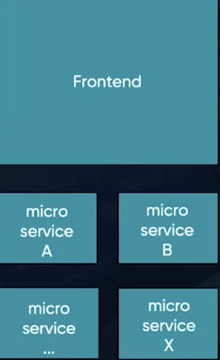

# DIA 01 - Semana Decoder

Iremos aprender os principais componentes de uma arquitetura de microservices com alto nivel de maturidade, desde os seus microservices de negócios até os microservices de configurações, 
as preocupações transversais e mais.

Este repositório está usando como base o video 01 da semana Decoder, lecionado pela [Michelli Britto]()

A ideia é ser possível entender modelos e padrões de arquitetura, resolver problemas e criar soluções (seja para minimizar risco ou melhorar desempenho de aplicações) e criar softwares flexíveis.

# Evolução arquitetural

## Sistema monolítico

Aplicações de um único bloco (frontend + backend), com regras de negócio fortemente acopladas, geralmente utilizam uma única base de dados.

Conforme o tempo foi passando as aplicações passaram a ser cada vez mais distribuídas. Mas isso não ocorreu rapidamente!

Primeiro, tivemos uma divisão mais parcial (mais macro), com o frontend sendo divido do backend. Mas mesmo assim, ainda tínhamos um sistema monolítico.

E assim, as arquiteturas foram evoluindo cada vez mais, ficando mais distribuídas, até chegarmos na arquitetura de microservices.

## Arquitetura microservices

Ou seja, ao invés de termos no backend uma aplicação de um único bloco com as regras fortemente acopladas, temos uma arquitetura constituida por MÚLTIPLOS serviços.

Cada serviço com sua responsabilidade, funcionalidade (funcionando de forma independente) e se comunicando entre sí. Fora que também, cada um com sua base de dados.

## Micro FrontEnds + Microservices (atual 2024)

Essa divisão (distribuição) chegou até mesmo ao frontend. Ou seja, ao invés das aplicações frontends serem constituidas em uma só aplicação, ela também pode ser formada por múltiplos micro frontends.

Portanto, a arquitetura de microservices é a solução as limitações dos sistemas monolíticos.

# Benefícios de Microservices

## Manutenibilidade 

Capacidade de realizar a manutenção de regras de negócio, leis que vão surgindo a todo momento, inserindo-as em nossas aplicações.

Até mesmo mudança de versões que vão surgindo no mercado.

## Alta disponibilidade

Priorizar a disponibilidade em arquiteturas distribuídas.

## Flexibilidade tecnológica

Como teremos cenários isolados, serviços independentes, podemos inserir tecnologias ideias para cada casso específico.

## Independência das Equipes

Consequência da flexibilidade tecnológica.

## Melhor performance 

Teremos um controle mais minucioso da aplicação.

## Divisão da complexibilidade do negócio

A aplicação será dividida em múltiplos serviços, em cenários menores.

## Isolamento a falhas

Consequência da divisão de complexibilidade.

## Alta escalabilidade

Teremos um controle mais minucioso da escalabilidade.

## Baixo acoplamento

Microservices devem ser projetados de modo que cada serviço tenha o mínimo de dependência de outros. Isso facilita a manutenção e a escalabilidade, permitindo que serviços sejam modificados ou atualizados 
de forma independente, sem impactar o sistema inteiro.

## Melhor testabilidade

Consequência dos cenários isolados.

## Agilidade nas mudanças

Foi o que citamos na Manutenibilidade. 

Porém, também será possível atualizar a aplicação de uma forma mais ágil.

## Isolamento da modelagem de dados

Cada microservice deve ter seu próprio banco de dados ou estrutura de dados isolada para evitar conflitos e dependências diretas. 

Isso permite que cada serviço use tecnologias e estruturas de dados mais adequadas para sua função, além de melhorar a segurança e a escalabilidade do sistema.

## Aumento da resiliência

Microservices aumentam a resiliência do sistema ao distribuir funcionalidades em serviços independentes. Se um serviço falha, os outros podem continuar operando, 
minimizando o impacto para o usuário. Técnicas como circuit breakers, retries, e failover ajudam a gerenciar falhas e tornam o sistema mais robusto.

# Resumo

Arquitetura de microservices nos permite criar softwares flexíveis e sustentáveis, que são capazes de acompanhar mudanças de negócio e modernizações tecnológicas.

# Modelagem arquitetura microservices (case sistema EAD)

Precisamos entender o negócio o máximo possível para realizar sua divisão microservices de forma correta.

Como é possivel ver na imagem, precisaremos ter:

- Gestão de usuários;
- Funcionalidades e responsabilidades relacionados a cursos, notificações e pagamentos.

Os possíveis microserviços da imagem acima:

Um microservice para tratar toda a gestão do usuário, outro para implementar as funcionalidades dos cursos, notificações e pagamentos.

Portanto, esses microservices serão responsáveis por implementar as regras de negócio da aplicação.

Outro ponto para se atentar no tocante a divisão de microservices é a granularidade dos mesmos, veja:

## Granularidade microservices

Precisamos ter cuidado para não criar sistemas "mini monolíticos" ou "nano services".

A granularidade em microservices refere-se ao nível de divisão e especificidade das funcionalidades em serviços independentes. Em outras palavras, é sobre o "tamanho" e a "especialização" de cada microservice.

Em um sistema com granularidade adequada:

- Cada microservice é focado em uma funcionalidade específica ou em um contexto de negócios pequeno, o que facilita a manutenção, a escalabilidade e o desenvolvimento independente de cada serviço.

- Um serviço com alta granularidade seria muito específico, realizando uma função bem estreita, enquanto um serviço com baixa granularidade seria mais amplo e genérico, englobando várias funções.

Se os serviços forem muito granulares (pequenos demais), o sistema pode se tornar difícil de gerenciar devido ao número de serviços interdependentes. 

Por outro lado, se forem pouco granulares (grandes demais), pode ocorrer um aumento no acoplamento e uma perda de benefícios como a independência de escalabilidade e a resiliência.

❗Portanto, caso a aplicação esteja muito grande e com alto acoplamento, talvez o ideal seja dividir ela um pouco mais.

Por exemplo, um Microservices de pagamento (PaymentService) pode ser dividido em dois microservices, um exclusivo para conectar a gateway do Pagseguro e outro para conectar a do Paypal.

Um microservice de notificação (NotificatonService), por ser dividido em outros microservices (um para gmail, outro para AWS e outro para SMS), por exemplo.

